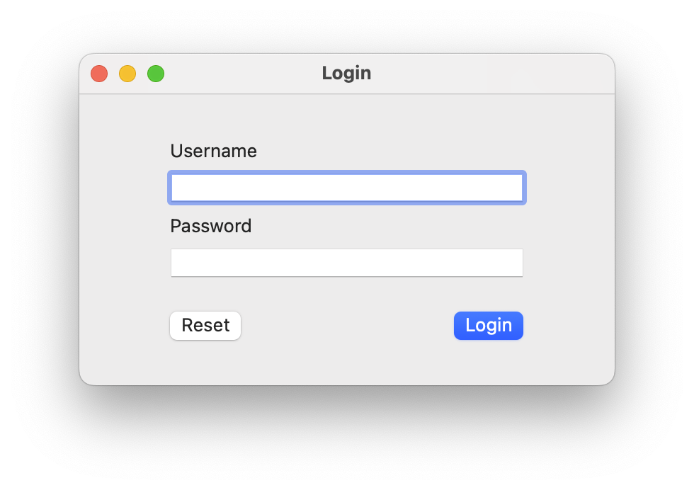

# learning-swiftui

A place for experiments.

Resources used:

- [Cocoa Basics Part Zero: Introduction](https://blog.xoria.org/cocoa-basics-0/)
- [Cocoa Basics Part One: The Application Structure](https://blog.xoria.org/cocoa-basics-1/)
- [Cocoa Basics Part Two: Our First Window](https://blog.xoria.org/cocoa-basics-2/)

## Gallery

<table>
  <tr>
    <td>
      
    </td>
    <td>
      
    </td>
  </tr>
  <tr>
    <td>
      
    </td>
    <td>
      
    </td>
  </tr>
  <tr>
    <td>
      
    </td>
    <td>
    </td>
  </tr>
</table>
